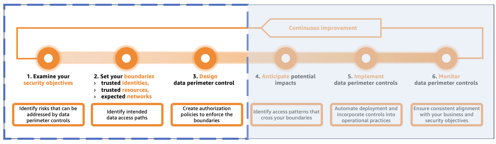

# Data Perimeter Policy Examples

Copyright Amazon.com, Inc. or its affiliates. All Rights Reserved. SPDX-License-Identifier: CC-BY-SA-4.0

## Table of Contents

* [DISCLAIMER](#disclaimer)
* [Introduction](#introduction)
* [Getting started](#getting-started)
* [Implementation](#implementation)
* [License summary](#license-summary)

## DISCLAIMER

The sample code; software libraries; command line tools; proofs of concept; templates; or other related technology (including any of the foregoing that are provided by our personnel) are provided to you as AWS Content under the AWS Customer Agreement, or the relevant written agreement between you and AWS (whichever applies). You should not use this AWS Content in your production accounts, or on production or other critical data without thoroughly testing and verifying its applicability to your environment. You are responsible for testing, securing, and optimizing the AWS Content, such as sample code, as appropriate for production grade use based on your specific quality control practices and standards. This AWS Content is intended to help you achieve your data perimeter objectives, but is not comprehensive and may not address every scenario. Deploying AWS Content may incur AWS charges for creating or using AWS chargeable resources, such as running [Amazon Elastic Compute Cloud (Amazon EC2)](https://aws.amazon.com/pm/ec2/) instances or using [Amazon Simple Storage Service (Amazon S3)](https://aws.amazon.com/s3/) storage.

## Introduction

This repository contains example policies to help you implement a [data perimeter on AWS](https://aws.amazon.com/identity/data-perimeters-on-aws/). The policy examples in this repository cover some common patterns and are for reference purposes only. Tailor and extend these examples to suit the needs of your environment.

## Getting started

A data perimeter is a set of preventive controls you can use to help ensure that only your trusted identities access your trusted resources from expected networks. These controls act as always-on boundaries to help protect sensitive data from unintended access and data disclosure risks. 

To help you get started, we cover three initial phases of a data perimeter implementation journey: 1. Examine your security objectives, 2. Set your boundaries, and 3. Design data perimeter controls. For details about the other phases of the journey such as impact analysis, see [Establishing a data perimeter on AWS: Analyze your account activity to evaluate impact and refine controls](https://aws.amazon.com/blogs/security/establishing-a-data-perimeter-on-aws-analyze-your-account-activity-to-evaluate-impact-and-refine-controls/).

**Note**: A data perimeter is a set of [AWS Identity and Access Management (IAM)](https://aws.amazon.com/iam/) authorization controls that helps restrict access over AWS APIs. Other types of security controls for preventing unauthorized access, such as network traffic inspection and encryption, are not covered in this repository.

### Examine your security objectives

The first step in implementing a data perimeter is identifying areas where data perimeter controls could help improve your security posture or optimize the implementation of controls for your organization's security control objectives. Your control objectives can be influenced by a variety of factors such as compliance and regulatory requirements, legal and contractual obligations, types of workloads, data classification, and your organizations’ threat model. When your control objectives are well-defined and prioritized, identify those that can be achieved by using data perimeter controls. 

To better inform the iterative risk-based approach to implementing data perimeter controls, you need to understand which security risks and threat vectors they help address. The following table contains data perimeter control objectives mapped to common security risks. You can learn more about the security objectives and risks reduced by each perimeter type by reading the blog posts linked in the "Security risk reduced" column.

|Data perimeter	| Control objective| Security risk reduced |
|--- |---	|---	|
|Identity perimeter  |Only trusted identities can access my resources   Only trusted identities are allowed from my network |[Unauthorized access by identities external to your organization](https://aws.amazon.com/blogs/security/establishing-a-data-perimeter-on-aws-allow-only-trusted-identities-to-access-company-data/)|
|Resource perimeter |My identities can access only trusted resources   Only trusted resources can be accessed from my network|[Unintended data movement to resources outside your organization](https://aws.amazon.com/blogs/security/establishing-a-data-perimeter-on-aws-allow-only-trusted-resources-from-my-organization/) |
|Network perimeter |My identities can access resources only from expected networks   My resources can only be accessed from expected networks |[Use of credentials outside your corporate environment](https://aws.amazon.com/blogs/security/establishing-a-data-perimeter-on-aws-allow-access-to-company-data-only-from-expected-networks/) |

Your cloud operating model and specific use of AWS services should inform the necessity for specific data perimeter controls. Though you may have existing controls in place to address data perimeter objectives, it's important to evaluate their effectiveness. If these controls don't reduce risks to an acceptable level or fall short of fully achieving your security objectives, implementing data perimeter controls can provide a scalable solution.

### Set your boundaries

After your security objectives are defined and data perimeter controls are selected, you need to define what trusted identities, trusted resources, and expected networks mean to your organization. These terms are defined as follows:

* **Trusted identities**: Principals (IAM roles or users) within your AWS accounts, or AWS services acting on your behalf. 
* **Trusted resources**: Resources owned by your AWS accounts or by AWS services acting on your behalf. 
* **Expected networks**: Your on-premises data centers and virtual private clouds (VPCs), or networks of AWS services acting on your behalf.

To establish effective security boundaries, you might need to expand your data perimeter definitions to encompass the identities, resources, or networks of your trusted partners. For example, you could be working with business partners that require your principals to upload or download data to or from Amazon S3 buckets that belong to their account. You will need to collect your business partners’ AWS account IDs to include in the data perimeter policies.

### Design data perimeter controls

After you define your trust boundaries based on your business and security requirements, you can start designing the authorization controls for enforcing these boundaries. You should start by reviewing the default data perimeter policy examples provided in this repository. See [General data perimeter guidance](#General-data-perimeter-guidance) for more details. You may need to tailor and extend the example policies to suit the needs of your environment and account for all intended access patterns. See [Service-specific data perimeter guidance](#Service-specific-data-perimeter-guidance) for additional considerations specific to individual AWS services.

#### General data perimeter guidance

To achieve data perimeter objectives, you will primarily use three policy types: [service control policies (SCPs)](https://docs.aws.amazon.com/organizations/latest/userguide/orgs_manage_policies_scps.html), [resource control policies (RCPs)](https://docs.aws.amazon.com/organizations/latest/userguide/orgs_manage_policies_rcps.html), and [VPC endpoint policies](https://docs.aws.amazon.com/vpc/latest/privatelink/vpc-endpoints-access.html#vpc-endpoint-policies). The following table illustrates the relationships between data perimeter objectives and the default data perimeter policies provided in this repository.

|Perimeter type	| Control objective| Applied on | Default policy examples |
|--- |---	|---	|---	|
|Identity perimeter  |Only trusted identities can access my resources |Resource |[identity_perimeter_rcp.json](resource_control_policies/identity_perimeter_rcp.json)|
|Identity perimeter  | Only trusted identities are allowed from my network |Network |[default_endpoint_policy.json](vpc_endpoint_policies/default_endpoint_policy.json)|
|Resource perimeter |My identities can access only trusted resources |Identity |[resource_perimeter_scp.json](service_control_policies/resource_perimeter_scp.json)|
|Resource perimeter |Only trusted resources can be accessed from my network |Network |[default_endpoint_policy.json](vpc_endpoint_policies/default_endpoint_policy.json)|
|Network perimeter |My identities can access resources only from expected networks |Identity |[network_perimeter_vpceorgid_scp.json](service_control_policies/network_perimeter_vpceorgid_scp.json), [network_perimeter_sourcevpc_scp.json](service_control_policies/network_perimeter_sourcevpc_scp.json)|
|Network perimeter |My resources can only be accessed from expected networks |Resource |[network_perimeter_vpceorgid_rcp.json](resource_control_policies/network_perimeter_vpceorgid_rcp.json), [network_perimeter_sourcevpc_rcp.json](resource_control_policies/network_perimeter_sourcevpc_rcp.json)|

See README.md in the [service_control_policies](service_control_policies/README.md), [resource_control_policies](resource_control_policies/README.md), and [vpc_endpoint_policies](vpc_endpoint_policies/README.md) folders for information about the exact controls included in the data perimeter policies linked in the preceding table.

To achieve data perimeter control objectives with resources that are currently not supported by RCPs, you can use [resource-based policies](resource_control_policies/resource_based_policies), which are policies that are attached to resources directly. 

To enforce data perimeter controls on your networks, use the [default_endpoint_policy.json](vpc_endpoint_policies/default_endpoint_policy.json) for services without service-specific VPC endpoint policy example in the [vpc_endpoint_policies](vpc_endpoint_policies) folder. For services with provided policy examples, such as AWS Systems Manager or Amazon EC2, start with those policies because they account for known service access patterns that require customizations to the default data perimeter controls. See README.md in the [vpc_endpoint_policies](vpc_endpoint_policies/README.md) folder for details about data access patterns to consider when implementing data perimeter controls on your networks.

#### Service-specific data perimeter guidance

Before using certain AWS services, you may want to review additional considerations to take into account when implementing a data perimeter for a service. See [Service-specific guidance](service_specific_guidance/README.md) to determine whether additional considerations apply to a specific service and which controls you might want to implement in addition to the general data perimeter guidance and default policies. When AWS services make calls to other services on your behalf, you might need to review service-specific guidance for all services in use to implement appropriate controls. For example, when using services that store data using your Amazon S3 buckets, consider implementing data perimeter controls for Amazon S3 by consulting S3-specific guidance for comprehensive control coverage. Evaluate your organization's cloud operating model, existing security controls, and risk acceptance criteria to determine whether any additional controls are necessary.

**Note**: The effectiveness of data perimeter controls relies heavily on fundamental cloud operational elements implemented correctly, including account management, governance strategy, deployment mechanisms, operating models, and change management processes. For comprehensive guidance about these fundamentals, see [Organizing Your AWS Environment Using Multiple Accounts](https://docs.aws.amazon.com/whitepapers/latest/organizing-your-aws-environment/organizing-your-aws-environment.html) and [Operational Excellence Pillar - AWS Well-Architected Framework](https://docs.aws.amazon.com/wellarchitected/latest/operational-excellence-pillar/welcome.html).

#### Tagging conventions and governance

In addition to the default and service-specific data perimeter policies, consider implementing [data_perimeter_governance_scp.json](service_control_policies/data_perimeter_governance_scp.json) and [data_perimeter_governance_rcp.json](resource_control_policies/data_perimeter_governance_rcp.json). These policy examples demonstrate how to protect data perimeter control dependencies, such as principal and resource tags used to manage their scope. 

Policy examples in this repository use the `aws:PrincipalTag/tag-key` and `aws:ResourceTag/tag-key` global condition keys to control the scope of data perimeter guardrails with the following tagging conventions. You should follow your existing tagging strategy or [AWS tagging best practices](https://docs.aws.amazon.com/whitepapers/latest/tagging-best-practices/tagging-best-practices.html) when implementing in your environment.

Note that `aws:ResourceTag/tag-key`only works with resources that [support authorization based on tags](https://docs.aws.amazon.com/IAM/latest/UserGuide/reference_aws-services-that-work-with-iam.html). For details on supported service actions, see the [Service Authorization Reference](https://docs.aws.amazon.com/service-authorization/latest/reference/reference.html). 

1. Tag [AWS Identity and Access Management](https://aws.amazon.com/iam/) (IAM) principals and resources in your accounts that you would like to target with network perimeter controls with the `dp:include:network` tag key and the value set to `true`. You may want to start enforcing network perimeter controls on IAM principals used by human users to access AWS services interactively in the AWS Management Console, or programmatically with the AWS CLI, AWS Tools for PowerShell, or API.
2. Tag IAM principals and resources in your accounts that should be excluded from the network perimeter with the `dp:exclude:network` tag key and the value set to `true`. This tag key can be used for human users and applications that should be able to use AWS services from outside of your expected network, or for resources that should not have the network perimeter applied.
3. Tag IAM principals and resources in your accounts that should be excluded from the identity perimeter with the `dp:exclude:identity` tag key and the value set to `true`. This tag key is designed for human users and applications that should be able to use AWS services without being restricted by identity perimeter controls. This tag can also be used on resources that should not have the identity perimeter applied, such as those with a business reason to be accessible by a large number of external identities (public resources).
4. Tag IAM principals in your accounts that should be excluded from the resource perimeter with the `dp:exclude:resource` tag key and the value set to `true`. This tag key is designed for human users and applications that should be able to access resources that do not belong to your organization.
5. Tag IAM principals in your accounts that should be excluded from the resource perimeter with the `dp:exclude:resource:<service>` tag key and the value set to `true`. This tag key is designed for human users and applications that should be able to access service-specific resources that do not belong to your organization.
6. Tag IAM principals and resources in your accounts that should be excluded from all data perimeters with the `dp:exclude` tag key and the value set to `true`. This tag key is designed for human users, applications, and resources that should not be restricted by any perimeter control.

The preceding tags are used in default, service-specific, and governance data perimeter policies based on the impact each individual control has on a particular data perimeter type. Each tag may appear in multiple policy statements to provide broad exceptions based on the six data perimeter objectives. You can adopt a more granular tagging convention and modify the example policies based on the tagging strategy and governance adopted in your organization.

Because the preceding tags are used for authorization, the [data_perimeter_governance_scp](service_control_policies/data_perimeter_governance_scp.json) and [data_perimeter_governance_rcp](resource_control_policies/data_perimeter_governance_rcp.json) policy examples include statements to protect these tags from unauthorized changes. In the `data_perimeter_governance_scp` example, only principals in your organization with the `team` tag and the value set to `admin` will be able to apply and modify these tags. `data_perimeter_governance_rcp` demonstrates how to protect session tags with an exception for tags that are set by your trusted SAML identity provider(s). 

Note that if you are using [AWS Control Tower](https://aws.amazon.com/controltower/) to centrally manage and govern your accounts, you might also need to exclude [AWSControlTowerExecution and other roles](https://docs.aws.amazon.com/controltower/latest/userguide/roles-how.html) that the service uses to manage accounts on your behalf.

## Implementation

To effectively use the example policies in this repository, follow these steps:

1. Determine which policy and perimeter types to implement based on the control objectives they help achieve and your security requirements.
2. Replace the placeholder values in the example policies based on your definition of trusted identities, trusted resources, and expected networks:

    * Replace `<my-org-id>` with your [AWS Organizations](https://aws.amazon.com/organizations/) organization ID.
    * Replace `<region>` with the AWS Region to which you are deploying the policy.
    * Replace `<my-corporate-cidr>` with your corporate public IP space.
    * Replace `<my-vpc>` with a list of VPC IDs that constitute your network perimeter for a resource or an AWS Organizations entity to which you are applying a policy.
    * Replace `<load-balancing-account-id>` with the ID of the AWS account that belongs to the Elastic Load Balancing services (based on the Region for your load balancer) if access logging is in use. See [Enable access logs for your Classic Load Balancers](https://docs.aws.amazon.com/elasticloadbalancing/latest/classic/enable-access-logs.html#attach-bucket-policy) and [Access logs for your Application Load Balancer](https://docs.aws.amazon.com/elasticloadbalancing/latest/application/load-balancer-access-logs.html#access-logging-bucket-permissions) for a complete list of account IDs. 
    * Replace `<ecr-account-id>` with the ID of the AWS account that owns [Amazon Elastic Container Registry (Amazon ECR)](https://aws.amazon.com/ecr/) repositories that you require to be used in your environment. See ["Sid":"EnforceResourcePerimeterAWSResourcesECR"](https://github.com/aws-samples/data-perimeter-policy-examples/tree/main/service_control_policies#sidenforceresourceperimeterawsresourcesecr) and ["Sid": "AllowRequestsByOrgsIdentitiesToAWSResources"](https://github.com/aws-samples/data-perimeter-policy-examples/tree/main/vpc_endpoint_policies#sid-allowrequestsbyorgsidentitiestoawsresources) for more details.
    * Replace `<lambdalayer-account-id>` with the ID of the AWS account that owns [AWS Lambda](https://aws.amazon.com/lambda/) layers that you require to be used within your environment. See ["Sid":"EnforceResourcePerimeterAWSResourcesLambdaLayer"](https://github.com/aws-samples/data-perimeter-policy-examples/tree/main/service_control_policies#sidenforceresourceperimeterawsresourceslambdalayer) for more details.
    * Replace the following values to support third party integrations where access to third party resources or by third party identities is required:
        * Replace `<third-party-account-a>` and `<third-party-account-b>` with account IDs of third parties.
        * Replace `<action>` with specific actions required for third party integrations.
        * Replace `<third-party-resource-arn>` with the Amazon Resource Name (ARN) of the resource owned by a third party.  
        * If you do not have third party integrations that require access to your resources or networks:
            * Remove `<third-party-account-a>` and `<third-party-account-b>` from the `aws:PrincipalAccount` condition key in the resource control policy (RCP) examples.
            * Remove `"Sid": “AllowRequestsByOrgsIdentitiesToThirdPartyResources"` and `"Sid": "AllowRequestsByThirdPartyIdentitiesToThirdPartyResources"` statements from the VPC endpoint policy examples.
            * Remove the `"Sid":"EnforceResourcePerimeterThirdPartyResources"` statement from the `resource_perimeter_scp` SCP example.
    * Replace `<OIDC_provider_name_1>`, `<OIDC_provider_name_2>`, and `<my-tenant-value>` with the names of your trusted OIDC providers and tenant.        
    * Tag IAM identities and resources in your accounts in accordance with the tagging conventions for applying data perimeter controls (see the [Tagging conventions and governance](#tagging-conventions-and-governance) earlier in this document).
3. Deploy policies by using the AWS Management Console or AWS CLI. You can also automate the deployment by using your Infrastructure as Code and CI/CD solutions.
    * Implement SCPs and RCPs: 
        * To use the AWS Management Console, [create](https://docs.aws.amazon.com/organizations/latest/userguide/orgs_manage_policies_scps_create.html) and [attach](https://docs.aws.amazon.com/organizations/latest/userguide/orgs_manage_policies_scps_attach.html) an SCP and RCP to an account or an organizational unit (OU).
        * To use the AWS CLI, [create](https://docs.aws.amazon.com/cli/latest/reference/organizations/create-policy.html) and [attach](https://docs.aws.amazon.com/cli/latest/reference/organizations/attach-policy.html) a policy to an account or an OU.
    * Implement resource-based policies (only for services not yet supported by RCPs):
        * See [AWS services that work with IAM](https://docs.aws.amazon.com/IAM/latest/UserGuide/reference_aws-services-that-work-with-iam.html) for services that support resource-based policies and follow links in the **Resource-based policies** column, or see [AWS Documentation](https://docs.aws.amazon.com/) (select the applicable service) for instructions about how to apply a resource-based policy.
    * Implement VPC endpoint policies:
        * To use the AWS Management Console, [create](https://docs.aws.amazon.com/vpc/latest/privatelink/create-interface-endpoint.html) or [configure](https://docs.aws.amazon.com/vpc/latest/privatelink/interface-endpoints.html) a VPC endpoint.
        * To use the AWS CLI, [create](https://docs.aws.amazon.com/cli/latest/reference/ec2/create-vpc-endpoint.html) or [modify](https://docs.aws.amazon.com/cli/latest/reference/ec2/modify-vpc-endpoint.html) a VPC endpoint. 

## License Summary

The documentation is made available under the Creative Commons Attribution-ShareAlike 4.0 International License. See the LICENSE file.

The sample code within this documentation is made available under the MIT-0 license. See the LICENSE-SAMPLECODE file.
